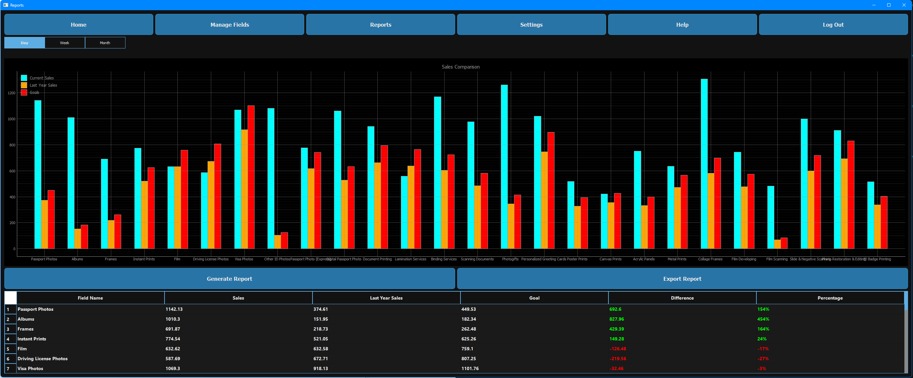

# Fluxoro – Automated Sales Management System

Fluxoro is a Python-based desktop application built as my final year project for the BSc (Hons) Software Engineering degree at the University of Hertfordshire, where I achieved First Class Honours.

The application streamlines retail sales management by automating report generation, providing clear visual dashboards, and making business data accessible to non-technical staff through a user-friendly interface.

## 📌 Features
- Secure Login System with role-based access
- Dynamic Reporting: export to CSV, Excel, and PDF
- Interactive Dashboards with bar charts and KPIs
- Custom PyQt5 UI styled with QSS
- Local Database (SQLite) for offline storage
- Real-Time Validation and input feedback

## 🛠 Tech Stack
| Technology | Purpose |
|------------|---------|
| Python | Core application logic |
| PyQt5 | Graphical user interface |
| SQLite | Local database |
| Pandas | Data handling and export |
| QSS | UI styling |
| GitHub | Version control |

---

## 🖼️ Screenshots

---

## 📁 How to Run

1. Clone this repo:  
   `git clone https://github.com/Dom031/fluxoro.git`
2. Navigate into the project:  
   `cd fluxoro`
3. Run the main script:  
   `python main.py`

*Requires Python 3.8+ and PyQt5 installed.*
